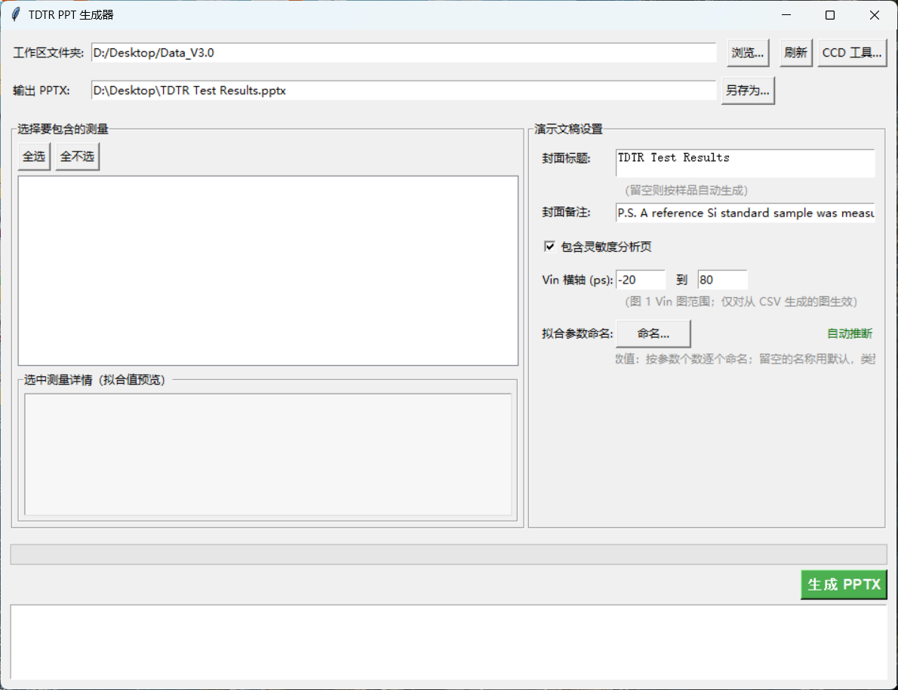
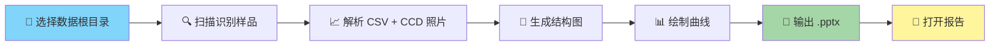

<div align="center">

<!-- ════════════════════ LOGO BANNER ════════════════════ -->
<!-- 
  想换 Logo？把 assets/logo.png 换成自己的图片即可。
  免费在线 Logo 生成: https://www.logodesignlove.com / https://looka.com
-->

<h1>
  
  TDTR · Results PPT Generator

</h1>

**从原始测量数据 → 一键生成专业 PPT 报告**
*Time-Domain Thermoreflectance Report Automation*

<p>
  <a href="#-特性"></a>
  <a href="#-快速开始"></a>
  
</p>

<p>
  
  
  
  
</p>



</div>

---

<!-- ════════════════════ TOC ════════════════════ -->
<details open>
<summary><b>📑 目录 Table of Contents</b></summary>

- [🎯 这是什么？](#-这是什么)
- [✨ 特性](#-特性)
- [🔧 技术栈](#-技术栈)
- [🚀 快速开始](#-快速开始)
- [📁 数据组织规范](#-数据组织规范)
- [⚙️ 配置文件](#️-配置文件)
- [📦 项目结构](#-项目结构)
- [🗺️ 路线图](#️-路线图)
- [🤝 贡献](#-贡献)
- [📜 许可证](#-许可证)

</details>

---

## 🎯 这是什么？

> 还在手动把几十个 TDTR 测量结果截图、贴进 PPT 吗？这个工具帮你 **告别重复劳动**。

**TDTR Results PPT Generator** 是一个桌面自动化工具：扫描你的实验数据文件夹，自动识别样品、测量参数与 CCD 图像，渲染曲线图与样品结构示意图，最终 **一键生成排版精美的 PPT 测试报告**。

```diff
+ 以前：手动整理数据 + 逐个截图贴图 → 半天 😩
+ 现在：选文件夹 → 点按钮 → 完成 → 30 秒 😎
```

---

## ✨ 特性

| 功能 | 说明 | 状态 |
| :--- | :--- | :--: |
| 📂 **智能数据解析** | 按正则规则自动从文件名提取日期/编号/样品/物镜/频率/功率 | ✅ |
| 📈 **Vin / FIT 曲线** | 从 CSV 兜底重绘高分辨率曲线图，支持自定义坐标范围 | ✅ |
| 🔬 **CCD 图像集成** | 自动关联显微镜照片（tif/tiff 自动转 png） | ✅ |
| 🧱 **样品结构图** | 按材料配置自动生成层状结构示意图（Al / Diamond / Si₃N₄ …） | ✅ |
| 📊 **敏感性分析** | 可选输出热导率敏感性曲线 | ✅ |
| 🧪 **参考样品识别** | 文件夹名含 `reference` / `Si standard` 等自动标记为标样 | ✅ |
| 🎨 **自定义材料库** | 识别词、显示名、配色全部可在 JSON 里扩展 | ✅ |
| 🖼️ **报告模板** | 支持自定义封面标题、备注与 Logo | ✅ |
| 🪟 **GUI 界面** | 原生桌面应用，记住上次路径，零命令行门槛 | ✅ |

---

## 🔧 技术栈

<p>
  
  
  
  
  
  
  
</p>

```
┌──────────────────────────────────────────────────────────┐
│  Python 3.11                                             
│  ├── 🖼️ Tkinter      →  桌面 GUI                         
│  ├── 📑 python-pptx  →  PPTX 生成                        
│  ├── 📈 Matplotlib   →  Vin / FIT / Sensitivity 曲线     
│  ├── 🔬 Pillow       →  CCD 图像处理 (tif→png)           
│  └── 🔍 Regex Engine →  文件名参数解析                   
└──────────────────────────────────────────────────────────┘
```

---

## 🚀 快速开始

> **零依赖运行** —— 无需安装 Python，双击即用。

```bash
# 1️⃣ 下载本仓库（或拷贝整个文件夹）
git clone https://github.com/JerryJQ/TDTR-Results-PPT-Generator.git
cd TDTR_PPT

# 2️⃣ 双击运行
TDTR_PPT(双击我使用）.exe
```

> [!TIP]
> 也可以直接把 `.exe` 整个文件夹拷走，放 U 盘里在实验室任意一台 Windows 上用。

### 🖥️ 使用流程



---

## 📁 数据组织规范

程序按以下目录结构自动识别（文件名需匹配 [naming_rules.json](naming_rules.json) 中的正则）：

```text
📁 Data_V3.0/
├── 📁 240611-#1-Si3N4-diamond-20x-9.9MHz-40mW-10mW/
│   ├── 📄 240611-#1-Si3N4-diamond-20x-9.9MHz-40mW-10mW-Vin.csv   ← 主测量数据
│   └── 📄 ...-FIT.csv                                            ← 拟合结果
│   ├── 📁 #1_FilmProfile/                                        ← CCD 照片文件夹
│   │   └── 📷 *.tif / *.png
│   └── 📁 5x/, 📁 20x/                                           ← 物镜文件夹
├── 📁 240612-#2-Si-reference-20x-9.9MHz-40mW-10mW/               ← 标样自动识别
└── ...
```

默认 CSV 命名规则：

```regex
^(?P<date>\d{6})-#?(?P<N>\d+)-(?P<sample>.+?)-(?P<lens>[^-]+?)-
 (?P<freq>[\d.p]+MHz)-(?P<pump>\d+)mW-(?P<probe>\d+)mW
 (?:-(?P<pumpR>[\d.]+)-(?P<probeR>[\d.]+))?$
```

> [!WARNING]
> 材料识别按顺序匹配：**越具体的词放越前面**（例如 `sic` 必须排在 `si` 之前，否则会被先匹配到 `si`）。

---

## ⚙️ 配置文件

所有配置均为 **可选的 JSON 文件**——删掉任意一个即回退到程序内置默认值。

| 文件 | 作用 |
| :--- | :--- |
| [config.json](config.json) | 记住上次路径、封面标题/备注、默认层结构、Vin 横轴范围 |
| [materials.json](materials.json) | 材料识别词 ↔ 显示名映射 + 结构图各层配色（#RRGGBB） |
| [naming_rules.json](naming_rules.json) | 文件名解析正则、CCD 文件夹规则、参考样品关键词 |
| [style.json](style.json) | 绘图 DPI、横轴范围、结构图几何比例、默认封面备注 |

### 🎨 内置材料配色一览

| 材料 | 识别词 | 颜色 |
| :--- | :--- | :---: |
| Diamond | `diamond` |  `#81D4FA` |
| Si₃N₄ | `si3n4` |  `#FFF59D` |
| SiO₂ | `sio2` |  `#B2EBF2` |
| SiC | `sic` |  `#CE93D8` |
| GaAs | `gaas` |  `#FFCC80` |
| GaN | `gan` |  `#C5CAE9` |
| Al₂O₃ | `al2o3` |  `#D1C4E9` |
| AlN | `aln` |  `#D7CCC8` |
| Cu | `copper` / `cu` |  `#FFAB91` |
| Si | `si` |  `#A5D6A7` |

> 新增材料示例：`"myMaterial": "#FF0000"`，记得在 `materials.json` 的 `materials` 列表和 `colors` 里同时添加。

---

## 📦 项目结构

```text
TDTR_PPT/
├── 🚀 TDTR_PPT(双击我使用）.exe   # 主程序（PyInstaller 打包）
├── 📁 _internal/                 # 运行时依赖（勿删）
├── 🖼️ assets/                    # 模板资源（封面背景 / Logo）
├── ⚙️ config.json                # 用户配置（路径记忆、封面、层结构）
├── 🧪 materials.json             # 材料识别表 + 配色
├── 🔍 naming_rules.json          # 文件名正则规则
├── 🎨 style.json                 # 绘图与版式样式
└── 📄 README.md                  # 你在这里 📍
```

---

## 🗺️ 路线图

- [x] 一键生成完整 PPT 报告
- [x] 材料库自定义与配色扩展
- [x] 参考样品自动识别
- [x] 敏感性曲线输出
- [ ] 🌐 导出 PDF 版本
- [ ] 📊 热导率结果汇总表（跨样品对比）
- [ ] 🧬 支持 Linux / macOS 打包
- [ ] 🤖 对接拟合软件自动拉取 FIT 参数

---

## 🤝 贡献

Contributions are welcome! 欢迎 Issue 和 Pull Request。

```bash
# Fork 之后
git checkout -b feat/amazing-feature
git commit -m "feat: add amazing feature"
git push origin feat/amazing-feature
# 然后打开一个 Pull Request 🎉
```

---

## 📜 许可证

<div align="center">

[](LICENSE)

**Made with ❤️ by JerryJQ
**

<sub>如果这个项目帮你省下了贴图的时间，欢迎给个 ⭐ Star 支持一下！</sub>

</div>
